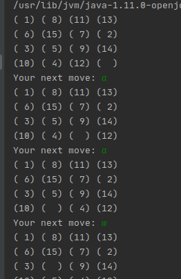
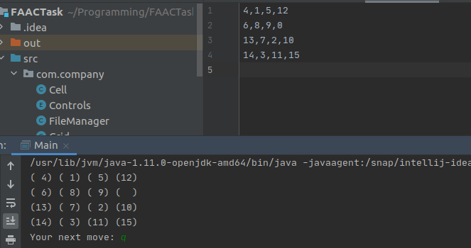

# FAACTask
# Instructions #
To move through the matrix you can use the WASD based keyboard combination. W(Up) S(Down) A(Left) D(Righ). 

I couldn't understand which keys were supposed to the this kind of operation so I did it with WASD. 

